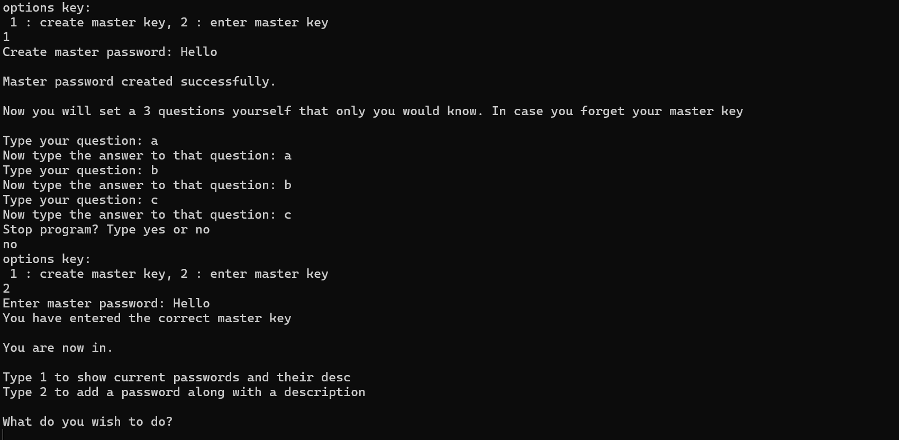
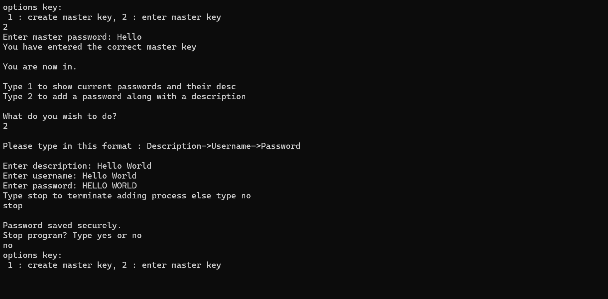
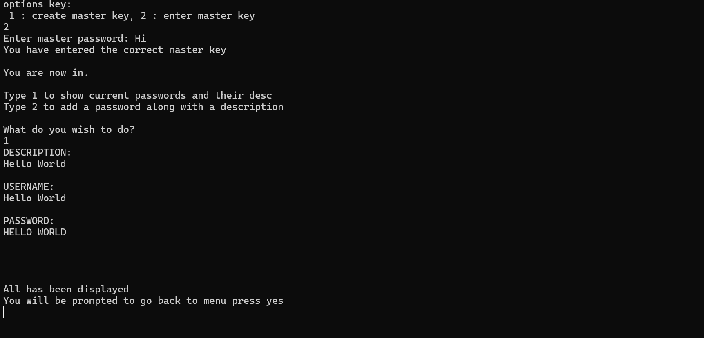
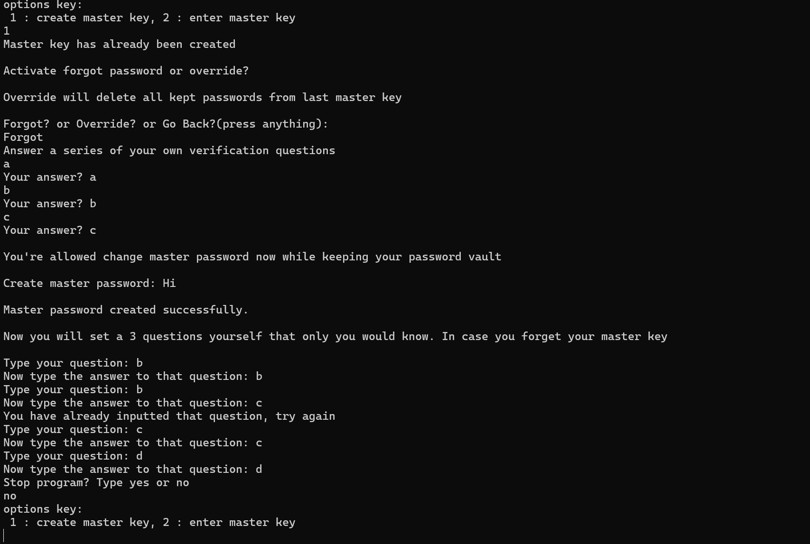

--- 
### CLI Password manager

#### Summary
Simple,classic, and not too flashy of a password manager that encrypts passwords with cryptographic functions from the python cryptography library. Uses hashes, base64, salting, and standard encryption to protect your passwords.

---

#### General Information and Usage:
- Runs on Executable_App\main.exe and its json dependencies. Just download or clone to run the executable

- Source files are available to see how code runs and for custom alterations if the user desires. Can be ran with python version 3.11 and above and requirements are also in the repo.

- General use of the app can be seen via the images in the next section, it is very straightforward to use except the 3 question prompt given to the user that is required to be remembered if the user wants to change the master key. Else they have to choose the override option which wipes everything.

---

#### Image Guide

##### Figure 1(basic usage and master key generation).

##### Figure 2(add passwords to password list).
 

##### Figure 3(show password list). 
 

##### Figure 4(change master key). 
 

--- 

